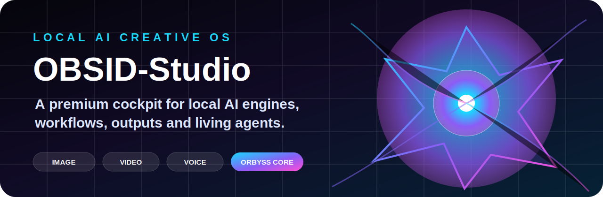
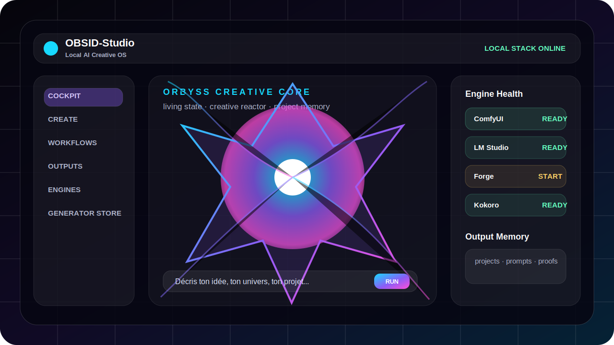
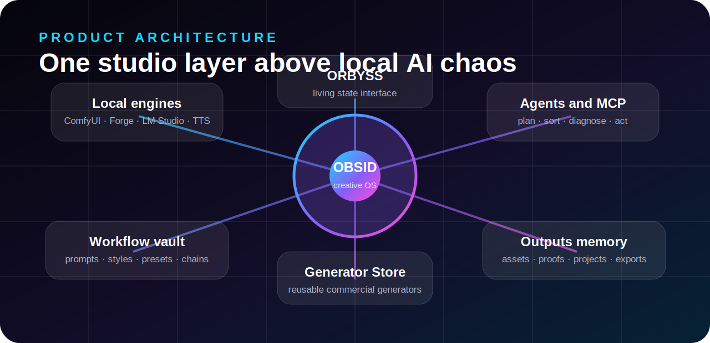
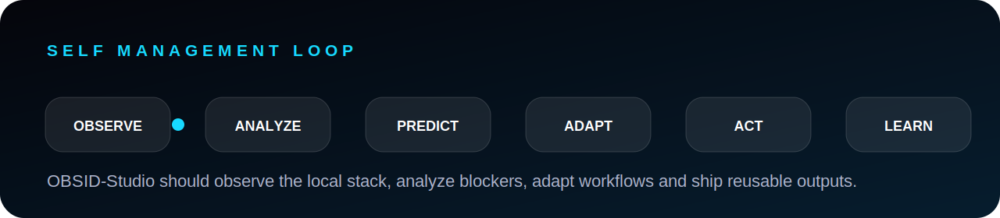

<p align="center">
  
</p>

<h1 align="center">OBSID-Studio</h1>

<p align="center">
  <b>Local-first AI Creative OS</b>
  <br>
  <sub>✨ Beta Test Ouverte — 25 places restantes ✨</sub>
</p>

<p align="center">
  <a href="https://florianhfk.github.io/obsid-studio-site/"><b>🌐 Site Web</b></a> •
  <a href="#beta-test"><b>🚀 Rejoindre la Beta</b></a> •
  <a href="#roadmap"><b>🗺 Roadmap</b></a> •
  <a href="#vision"><b>🎯 Vision</b></a> •
  <a href="#tech-stack"><b>🛠 Tech Stack</b></a>
</p>

<p align="center">
  
  
  
  
  
  
</p>

---

## 🚀 **Beta Test Ouverte**

**OBSID-Studio entre en phase de beta privée !** 
Nous cherchons **100 testeurs** pour façonner l'avenir de la création IA locale.

### ✅ **Ce que vous obtenez**
- Accès **anticipé** à OBSID-Studio
- Fonctionnalités **premium** pendant la beta
- Support **prioritaire**
- Influence sur le **développement**
- Tarif **early-bird à vie**

### 📝 **Comment s'inscrire**
1. Rendez-vous sur [le site web](https://florianhfk.github.io/obsid-studio-site/#beta)
2. Remplissez le **formulaire de beta test**
3. Attendez notre email de confirmation (sous 48h)

**🔥 25 places restantes — Dépêchez-vous !**

---

## 🎯 **Vision**

**OBSID-Studio** est un **cockpit IA local-first premium**.

Ce n'est pas juste un générateur. C'est une **couche produit** au-dessus d'une stack IA locale complexe :

| 🎨 **Créer** | 🤖 **Assister** | 📁 **Organiser** |
|-------------|----------------|------------------|
| Image, vidéo, musique, voix, texte | Guidage projet, prompts, workflows | Outputs, preuves, packs |
| Generator Store | Agents locaux | Santé des moteurs |
| Creative Packs | Suggestions prédictives | Diagnostic guidé |

<p align="center">
  
</p>

---

## 🏗 **Architecture Produit**

OBSID-Studio est **NEXUS-backed** :
- **NEXUS** reste la forge
- **OBSITOOLS** reste le cockpit opérateur
- **OBSID-Studio** devient l'expérience produit propre

<p align="center">
  
</p>

---

## 🌌 **ORBYSS**

ORBYSS est **l'interface sensible** du studio.

Il reflète l'état du produit en temps réel :
- **Idle** | **Thinking** | **Generating** | **Repair** | **Recovery** | **Export**

**Identité visuelle** : Asymétrique, cristallin, biomécanique, lumineux, réactif, premium.

<p align="center">
  
</p>

---

## 🗺 **Roadmap**

| Étape | Statut | Description |
|-------|--------|-------------|
| 01 | ✅ **Terminé** | Site vitrine |
| 02 | ✅ **Terminé** | Prototype cockpit + ORBYSS |
| 03 | ✅ **Terminé** | Runtime moteurs + diagnostics |
| 04 | ✅ **Terminé** | Assistant + System Care |
| 05 | 🔥 **En cours** | **Beta Test Privée (OUVERTE)** |
| 06 | 🚧 **À venir** | Version publique |

---

## 🛠 **Tech Stack**

| Catégorie | Technologie | Usage |
|----------|-------------|-------|
| **Frontend** | Vanilla HTML/CSS/JS | Site statique ultra-rapide |
| **Build** | [Vite](https://vitejs.dev/) | Développement et production |
| **CSS** | Custom + CSS Variables | Design futuriste |
| **JS** | Vanilla ES6+ | Navigation fluide |
| **PWA** | Service Worker | Cache offline |
| **Hosting** | GitHub Pages | Hébergement gratuit |

### 🔧 **Optimisations**
- **Images** : WebP (PNG → -94%), SVGO pour les SVG
- **CSS** : Minifié avec clean-css
- **JS** : Minifié avec Terser
- **HTML** : Minifié avec html-minifier
- **Lazy Loading** : `loading="lazy"` sur toutes les images
- **Service Worker** : Cache des assets pour le hors-ligne

---

## 📦 **Structure du Projet**

```
obsid-studio-site/
├── index.html              # Page principale
├── assets/
│   ├── css/
│   │   └── main.min.css    # CSS minifié
│   ├── js/
│   │   └── main.min.js     # JS minifié
│   └── images/             # Images optimisées
│       ├── favicon.svg
│       ├── obsid-mark.svg
│       ├── readme-hero.svg
│       ├── real-studio-preview.svg
│       ├── obsid-studio-look.webp  # Converti depuis PNG
│       └── ...
├── sw.js                   # Service Worker
├── sitemap.xml            # Sitemap pour le SEO
├── vite.config.js          # Configuration Vite
├── package.json            # Dépendances npm
├── build.sh                # Script de build
├── .gitignore              # Fichiers ignorés
└── README.md               # Ce fichier
```

---

## 🏃 **Getting Started**

### 📥 **Installation**

1. Cloner le dépôt :
   ```bash
   git clone https://github.com/FlorianHFK/obsid-studio-site.git
   cd obsid-studio-site
   ```

2. Installer les dépendances :
   ```bash
   npm install
   ```

3. Démarrer le serveur de développement :
   ```bash
   npm run dev
   ```
   > Le site sera disponible sur [http://localhost:5173](http://localhost:5173)

### 🏗 **Build pour la Production**

```bash
npm run build
```
> Génère un dossier `dist/` avec les assets optimisés.

### 📦 **Minification Manuelle**

Si vous ne voulez pas utiliser Vite :

```bash
# Minifier le CSS
npm run minify:css

# Minifier le JS
npm run minify:js

# Minifier le HTML
npm run minify:html
```

---

## 🤝 **Contribuer**

Les contributions sont les bienvenues ! Voici comment aider :

1. **Forker** le projet
2. Créer une **branche** (`git checkout -b feature/ma-fonctionnalité`)
3. **Commiter** vos changements (`git commit -m 'feat: ajouter X'`)
4. **Pousser** sur la branche (`git push origin feature/ma-fonctionnalité`)
5. Ouvrir une **Pull Request**

### 📝 **Types de contributions**
- 🐛 **Bug fixes**
- ✨ **Nouvelles fonctionnalités**
- 📚 **Documentation**
- 🎨 **Design/UX**
- 🔍 **Tests**

---

## 📜 **License**

Ce projet est sous **MIT License** — voir [LICENSE](LICENSE) pour plus de détails.

---

<p align="center">
  <b>OBSID-Studio transforme l'IA locale en une expérience produit premium.</b>
  <br>
  <sub>Rejoignez la révolution 🚀</sub>
</p>

<p align="center">
  <a href="https://florianhfk.github.io/obsid-studio-site/">🌐 Visitez le site</a> •
  <a href="#beta-test">🚀 Rejoignez la Beta</a> •
  <a href="https://twitter.com/FlorianHFK">🐦 Twitter</a>
</p>
