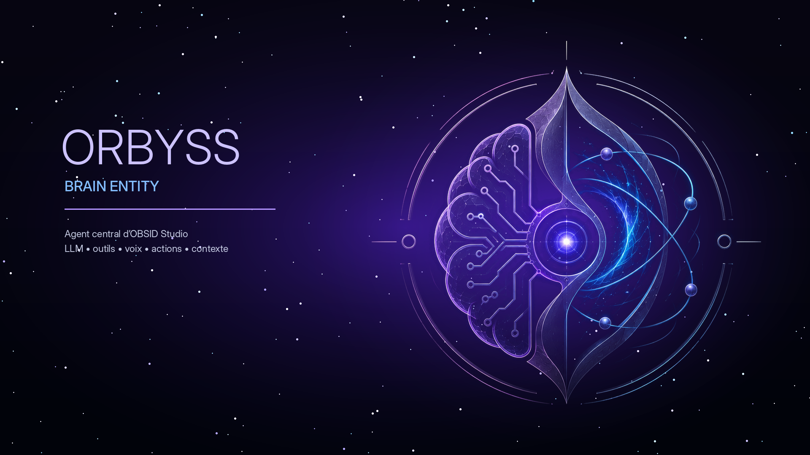

# OBSID Studio

**Local AI Creative Reactor** — le cockpit Windows qui réunit création IA locale, intelligence agentique et orchestration système.

<p>
  <a href="https://florianhfk.github.io/obsid-studio-site/"><strong>Voir le site</strong></a>
  ·
  <a href="https://obsidstudio.lemonsqueezy.com/checkout"><strong>Accéder à la Beta Founder</strong></a>
  ·
  <a href="LICENSE.md">Licence utilisateur</a>
</p>



## Le produit

OBSID Studio ne se contente pas d’empiler des outils IA. Il donne une surface de contrôle unique pour les utiliser, comprendre leur état et retrouver ce qu’ils produisent.

| Espace | Rôle |
|---|---|
| **ORBYSS** | Chat local, contexte, voix et actions assistées autour d’une entité visible. |
| **Creative Suite** | Images, vidéo, musique et voix via les moteurs locaux de la machine. |
| **OBSIDTOOLS** | Diagnostic, orchestration et état réel des runtimes. |

## Configuration cible

- Windows 10/11 x64
- 16 Go de RAM minimum
- GPU dédié recommandé
- Pour l’image et la vidéo : 32 Go de RAM et GPU NVIDIA 8 Go+ recommandés

## Beta Founder

- 29 € au lancement, au lieu de 79 €
- 1 machine par licence
- Licence v1.x à vie, mises à jour v1.x incluses
- Remboursement sous 14 jours selon les conditions de licence

> La beta est un produit vivant : les moteurs disponibles dépendent de la configuration et des modèles installés, et les retours utilisateurs participent aux priorités.

## Ce dépôt

Le dépôt contient le site vitrine statique servi par GitHub Pages. Il ne contient pas le code source de l’application OBSID Studio.

```text
index.html                 landing page
assets/style.css           design system et responsive
assets/app.js              navigation, animations, lightbox
assets/images/             visuels réellement utilisés par la landing
LICENSE.md                 licence utilisateur
```

Le site ne dépend d’aucun framework, d’aucun tracker et d’aucun build : un push vers `main` suffit à mettre à jour GitHub Pages.

## Contact

[contact@obsid-studio.com](mailto:contact@obsid-studio.com)

© 2026 Florian HFK. Tous droits réservés.
