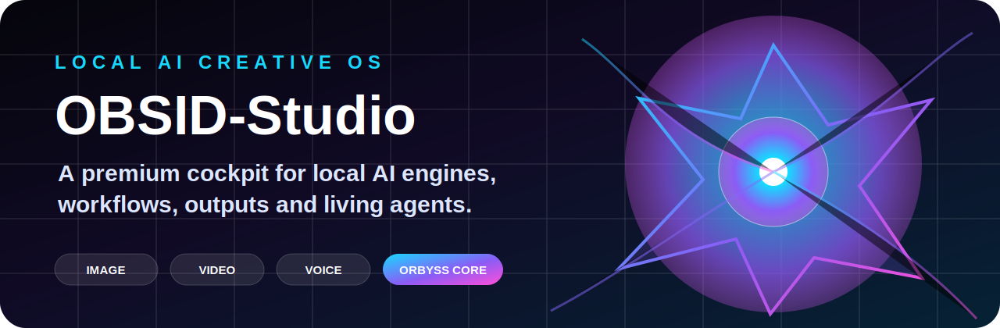
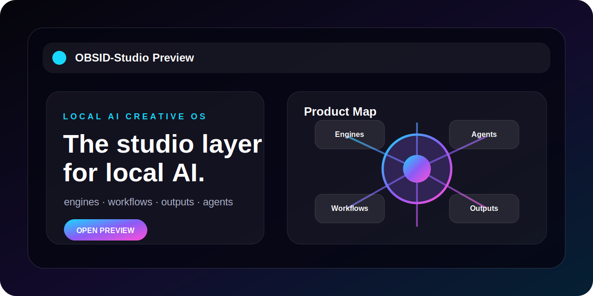
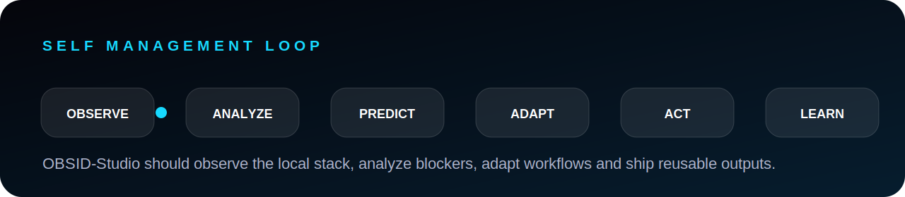

<p align="center"></p>

<h1 align="center">OBSID-Studio</h1>

<p align="center"><b>Local-first AI Creative OS</b></p>

<p align="center"><a href="https://florianhfk.github.io/obsid-studio-site/"><b>Live Website</b></a> | <b>Founder Preview</b> | <b>ORBYSS Core</b></p>

<p align="center">


</p>

---

## Vision

OBSID-Studio is a premium cockpit for local AI creation.

It turns scattered local engines into a clear product experience for image, video, music, voice, text, workflows, outputs and local agents.

<p align="center"></p>

## Product architecture

<p align="center"></p>

| Engine Layer | Creative Layer | Product Layer |
|---|---|---|
| Local models and tools | Workflows and presets | Outputs and deliverables |
| Honest runtime status | ORBYSS living state | Generator Store |
| Local-first control | Project memory | Commercial packs |

## ORBYSS

ORBYSS is the living visual core of the studio.

It represents the state of the system: idle, thinking, generating, repair and export.

Target identity: crystalline, biomechanical, luminous, reactive and premium.

<p align="center"></p>

## Roadmap

```text
01 Vision website
02 Native cockpit prototype
03 Local engine runtime
04 Workflows and output memory
05 Generator Store and private preview
```

## Promise

OBSID-Studio turns local AI from scattered power into a real creative product experience.
